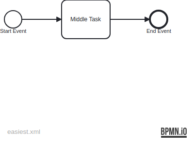
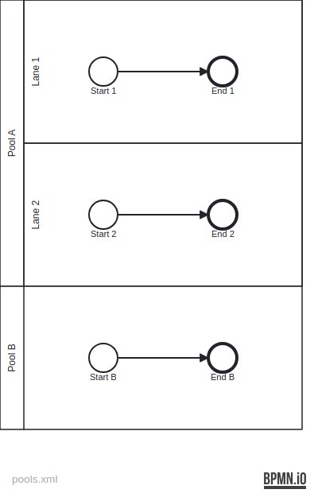
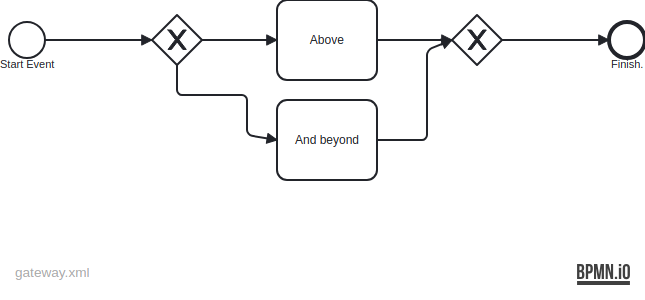
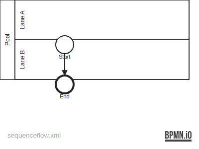
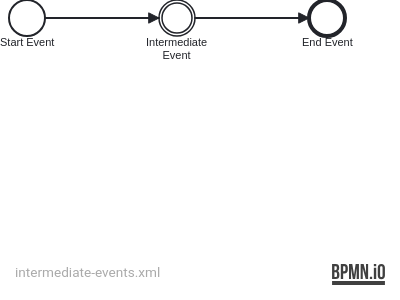

= BPMD - Business Process Modeling DSL
:icons: font

== Super Simple Example

This is an example of a very simple BPMN diagram. No pools, no lanes, no fork, no data.

.Super simple example


.Super simple example
[source]
----
include::easiest.bpmd[]
----
<1> The first event, if it is just an empty circle, is represented with a `#`.
<2> Regular inner activities without a symbol also use a `-`.
<3> Positive end events use the `.` symbol. `.` is used instead of `-` to better show the

== Pools and Lanes

.Pools and lanes example


.Super simple example
[source]
----
include::pools.bpmd[]
----
<1> A pool statement begins with `=`.
<2> A lane statement begins with `==`.
<3> A pool can directly contain nodes, it does not necessarily need a dedicated lane.

== Gateways

.Gateway example


.Gateway example
[source]
----
include::gateway.bpmd[]
----
<1> Outgoing splits are introduced with an `->`, then a label, and then a text label for visual display.
<2> After the `X` gateway you cannot simply add further nodes. Instead, you must introduce a new sequence flow, with the `G` node (as is done here), a new Pool `=` or with a sequence flow node `F`.
<3> `G <-` marks where one part of the lifeline continues. Since the gateway _node_ itself uses `X`, `+`, `O` or `*` to designate its type, `G` is used for the internal jump markers as it stands for Gateway.
<4> `G ->` say that one jumps to a joining gateway node.

== Sequence Flow (Jumping from one Lane to another Lane)

.Gateway example


.Gateway example
[source]
----
include::sequenceflow.bpmd[]
----
<1> `F ->label` says that from this point the lifeline continues at another point `label`.
<2> `F <-label` say that some other `F ->label` continues from this position.

== Edge Display Text

IMPORTANT: Edge Display Text will be parsed, but they are not further processed, yet. I.e. no warnings and they won't be present on the BPMN diagram.

All edges `<-label` and `->label` can also have an associated Display Text by using quotes: `<-label"Display Text".

Please specify a Display Text only on one side of an edge:

```
OD .. -> label "Only specify Display Text once for this edge"

...

OD .. <- label // No Display Text here.
```

== Intermediate Events

.An Intermediate Event.


.An Intermediate Event.
[source]
----
include::intermediate-events.bpmd[]
----
<1> Intermediate events use the same `#` symbol as start events.

== IDs

Every statement which represents a node in the diagram (that means excluding `=`, `==`, `G`, `F`) can have an arbitrary amount of IDs somewhere after the Display Text. For example this gateway node will have three IDs:

```
+ Gateway Node @id1 ->label1 @id2 ->label2 @id3
```

IDs can contain alphanumerical symbols, and `-`, `_` and `.`. No other symbols are allowed.

== Ideas

IMPORTANT: These are not implemented and are just ideas of how something could be done.

=== Implicit IDs

The Display Text of an element is at the same time an implicitly assigned ID, if not explicitly specified via `@id`. One can then use any unique prefix of an _implicit ID_ to refer to that Element, where the match is case-insensitive, with spaces being replaced by `-` and all special symbols except for `.-_` being removed. For explicit IDs, the full ID, case-sensitive needs to be specified.

For example: `- P2.2: Process Data` could be matched with `p2.2-` (to disambiguate with some `P2.2.1` node) or `P2.2-process-data`

=== Data Objects

NOTE: Create image once it is implemented.

.Gateway example
[source]
----
= Pool 1

# Receive Data
- P2.2: Process Data
. End

data-input P2.2 Input Data ->receive // <1> <3>
data-object Processable Data <-receive ->p2.2 @do-id // <2>
data-output <-p2.2 // <3>

= Pool 2

# Start Event
- P2.2.1: ... // <3>
. End
----
<1> Data is modeled via dedicated statements and uses `<-` and `->` to connect with tasks and events. Hopefully this gives the text file a better structure (from the perspective of the reader). Also, data elements are always part of some pool, so they need to be defined within the same pool (`=`) section where the connected other nodes live.
<2> There can be arbitrary many `<-` and `->` connections. And one can assign explicit IDs as well via `@`.
<3> The ID just needs to be unique across the sequence flow node IDs within the same pool (IDs of other data objects is not considered), as data cannot be used as is across pools. Therefor one needs to send messages.

One could think of shortcut syntax for when data moves between two consecutive elements (`data-object Name <>`, or even more concise `- Task >>:o"Name"`), but the need for such special cases needs to be determined, first.

=== Meta Stuff / Non-Nodes

NOTE: Create image once it is implemented.

Each non-node element would have its own specific syntax, and this would be a way to load in plugins.

.Non-Node example
[source]
----
= Pool 1

# Receive Data
- P2.2: Process Data
. End

data-input P2.2 Input Data ->receive
data-object Processable Data <-receive ->p2.2 @do-id
data-output <-p2.2

= Pool 2

# Start Event
- P2.2.1: ...
. End

// Note: imagine that the above content is a collaboratively edited file,
// and the content below is appended locally when creating a special version of this file,
// without needing to manipulate the actual content.
[id-map pool-1#(data-input)p2.2 @A] // <1>
[id-map pool-1#processable @B] // <1>
[id-map pool-1#(data-output:last) @C] // <1>
[color paths #red p2.2-input-data rec p end, #blue start p] // <2>
[color nodes #67a2f3 rec p2.2-] // <2>
[pe-bpmn PrivateKey in A, SharedSymmKey in B] // <3> <1>
----
<1> Some fancy ideas for ID mapping, if the input file is missing some crucial IDs. Could be XPath like. Not sure if this is necessary/useful.
<2> One could express coloring paths between nodes, or nodes itself.
<3> This could also be used for a plugin system where `pe-bpmn` (a plugin for integrating with PLEAK) would be registered on the CLI when running the tool. This plugin could arbitrarily modify the graph.
