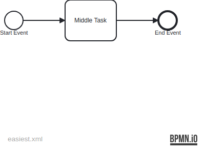
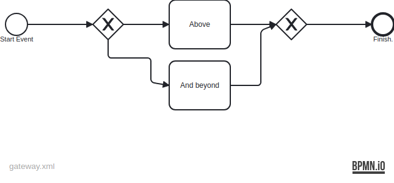
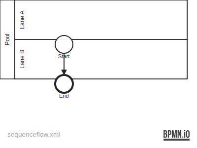

= BPMD - Business Process Modeling DSL
:icons: font

== Condensed Statement Reference

A statement is usually built up following a couple of rules. These rules don't make sense immediately if this is your first contact with BPMD, so refer to this section in parallel when looking at the following more specific sections.

```
XG Node Text @identifier ->a-label "Edge Text 1" ->another-label "Edge Text 2"
 ^ The second letter (in this case `G`) determines the general type of this statement:
   =: Grouping (pool, lane, some kind of subprocess),
   #, ., : Events
   -: Activities
   G: Gateways
   D: Data
^ The first letter (in this case `X`) further refines the type of this statement.

   The headings have one more symbol so they stick out better visually.
   P==: Pool (can have the `~multiple` type to become a Multiple-Instance Participant)
   ====: Synonym for `P=`.
   L==: Lane
   S==: Inner content of a subprocess
   C==: Inner content of a call activity
   !==: Event Subprocess Interrupting (they are put into the lane where they are defined)
   +==: Event Subprocess Non-Interrupting (they are put into the lane where they are defined)
   (In this case one can add additional `=` to allow for better visual highlighting of groups)

   .-: A regular Task (task types, only applicable for regular tasks, are explained in the next section. They are modeled with an additional attribute)
    -: Shorthand for `.-`.
   S-: Subprocess (Must match the name (or ID?) of a `S=`
   C-: Call Activity
   !-: Event Subprocess Interrupting
   +-: Event Subprocess Non-Interrupting
   T-: Transaction

   Task types:
   .- ~send: Task with message send symbol
   .- ~receive: Task with message send symbol
   .- ~manual: Manual task type
   .- ~user: User task type
   .- ~script: Script task type
   .- ~service: Service task type
   .- ~businessrule: Business rule task type
   .- ~multiple: Multiple instance task type (also works for pools!)
   Using `~` (**T**ilde for **T**ype) instead of new first-letter mnemonics, as (1) letters are clashing (service and subprocess) and might clash more if there will be more elements in a future version of BPMN
   These task types also seem to be usually added when refining the process, so it is not necessarily a fundamental property of the thing to be a manual task type, so it does not need to be on the left hand side.
   Also, it might be required later to add some information to e.g. script thing, but I am not sure about that.

   Data
   OD: Data Object
   SD: Data Store
   <D: Data Input
   >D: Data Output
    &: A continuation of the previous data object, to indicate that a new symbol should be used in the diagram but it's still part of the same semantic object.

   Gateways
   XG: Exclusive
    X: Shorthand for `XG`.
   +G: Parallel
    +: Shorthand for `+G`.
   OG: Inclusive
   *G: Complex
   #G: Event-Based
   There seem to be extensions where the #G and +G can be at the start.

   Event types - Starting / Intermediate (Normal, Event Subprocess (), Event Subprocess non-interrupting)
   .#: None event.
    #: Shorthand for `.#`.
   M#: Message event. Color depends on the direction of `->`/`<-`
   T#: Timer
   C#: Conditional
   >#: Link
   S#: Signal
   E#: Error
   ^#: Escalation
   <#: Compensation
   X#: Cancel
   ##: Multiple
   +#: Multiple Parallel

   Event types (in some situations it can be deduced, like start or end events, or when message flows are attached):
   .- ~send / ~throw: Make the symbol dark
   .- ~receive / ~catch: Make the symbol light

   End Event (Color depends on the direction of `->`/`<-`)
   ..: Blank end event
    .: Shorthand for `..`.
   M.: Message event.
   S.: Signal
   E.: Error
   ^.: Escalation
   !.: Termination
   <.: Compensation
   X.: Cancel
   #.: Multiple

   Boundary Event Interrupting (recommended to indent with two spaces) (`!` used since it terminates the task it is attached to):
     M!: Message event.
     T!: Timer
     C!: Conditional
     S!: Signal
     E!: Error
     ^!: Escalation
     <!: Compensation
     X!: Cancel
     #!: Multiple
     +!: Multiple Parallel

   Boundary Event Non-Interrupting (recommended to indent with two spaces) (`+` used since it starts a parallel sequence flow):
     M+: Message event.
     T+: Timer
     C+: Conditional
     S+: Signal
     ^+: Escalation
     #+: Multiple
     ++: Multiple Parallel

   SequenceFlow:
      F:

   MessageFlow:
      M:

```

== Super Simple Example

This is an example of a very simple BPMN diagram. No pools, no lanes, no fork, no data.

.Super simple example


.Super simple example
[source]
----
include::easiest.bpmd[]
----
<1> The first event, if it is just an empty circle, is represented with a `.#`.
<2> Regular inner activities without a symbol use `T-`.
<3> Blank end events use the `..` symbol.

== Pools and Lanes

//.Pools and lanes example
//image::pools.png[width=60%]

.Super simple example
[source]
----
include::pools.bpmd[]
----
<1> A pool statement begins with `=`.
<2> A lane statement begins with `==`.
<3> A pool can directly contain nodes, it does not necessarily need a dedicated lane.

== Gateways

.Gateway example


.Gateway example
[source]
----
include::gateway.bpmd[]
----
<1> Outgoing splits are introduced with an `->`, then a label, and then a text label for visual display. The target is either a dedicated "landing" node `F @label@`, or ..
<2> .. it can also jump directly to a node. In this case the ID is deduced from the display text. The dedicated ``F @label` should be preferred, since this label can better describe the "sense" of this branch and won't change during refactoring, whereas the task itself can change its text, or a new node is introduced before it, so it is more volatile and then one needs to change the jump-side more often.
<3> Another benefit of using `F @label@` is that F nodes in the same pool can share the same target label. So one can easily add new cases without changing the gateway statement. A display text can be added to the edge on the target `F "Optional Display Text" @label` side.
<4> Further there is a shorthand syntax for jumping directly to the next node. This can be beneficial to better highlight in the code what is the "success" path and have this a tidbit more cleanly in one sequence. Note that the shorthand `->>` syntax does not work to cross lanes.
<5> After the `XG` gateway you cannot simply add further nodes. Instead, you must introduce a new sequence flow with a sequence flow node (`F`) or gateway node (eg `XG`), or start a new section (e.g. a new Pool `=`).
<6> `XG @label` marks where the sequence flows converge again.
<7> `F ->` says that the sequence flow shall continue at another place, in this case a joining gateway. So usually a jump uses `->`, and a landing uses `@`.

== Sequence Flow (Jumping from one Lane to another Lane)

.Gateway example


.Gateway example
[source]
----
include::sequenceflow.bpmd[]
----
<1> `F ->label` says that from this point the lifeline continues at another point `label`.
<2> `F <-label` say that some other `F ->label` continues from this position.

== Edge Display Text

IMPORTANT: Edge Display Text will be parsed, but they are not further processed, yet. I.e. no warnings and they won't be present on the BPMN diagram.

All edges `<-label` and `->label` can also have an associated Display Text by using quotes: `<-label"Display Text".

Please specify a Display Text only on one side of an edge:

```
F -> label "Only specify Display Text once for this edge"

...

F <- label // No Display Text here.
```

== IDs

Every statement which represents a node in the diagram (that means excluding `=`, `==`, `G`, `F`) can have an arbitrary amount of IDs somewhere after the Display Text. For example this gateway node will have three IDs:

```
+ Gateway Node @id1 ->label1 @id2 ->label2 @id3
```

IDs can contain alphanumerical symbols, and `-`, `_` and `.`. No other symbols are allowed.

== Ideas

IMPORTANT: These are not implemented and are just ideas of how something could be done.

=== Implicit IDs

The Display Text of an element is at the same time an implicitly assigned ID, if not explicitly specified via `@id`. One can then use any unique prefix of an _implicit ID_ to refer to that Element, where the match is case-insensitive, with spaces being replaced by `-` and all special symbols except for `.-_` being removed. For explicit IDs, the full ID, case-sensitive needs to be specified.

For example: `- P2.2: Process Data` could be matched with `p2.2-` (to disambiguate with some `P2.2.1` node) or `P2.2-process-data`

=== Data Objects

NOTE: Create image once it is implemented.

.Gateway example
[source]
----
= Pool 1

M# Receive Data ~send
- P2.2: Process Data
. End

= Pool 2

# Start Event
- P2.2.1: ... // <3>
. End

<D P2.2 Input Data ->receive // <1> <3>
OD Processable Data <-receive ->p2.2 @do-id // <2>
>D Output Data <-p2.2 // <3>
----
<1> Data is modeled via dedicated statements and uses `<-` and `->` to connect with tasks and events. Hopefully this gives the text file a better structure (from the perspective of the reader). Also, data elements are always part of some pool, so they need to be defined within the same pool (`=`) section where the connected other nodes live.
<2> There can be arbitrary many `<-` and `->` connections. And one can assign explicit IDs as well via `@`.
<3> The ID just needs to be unique across the sequence flow node IDs within the same pool (IDs of other data objects is not considered), as data cannot be used as is across pools. Therefor one needs to send messages.

One could think of shortcut syntax for when data moves between two consecutive elements (`data-object Name <>`, or even more concise `- Task >>:o"Name"`), but the need for such special cases needs to be determined, first.

==== Duplicating the same Data Object within the same Pool

There should be syntax to have the same data object appear at multiple places, even in different pools, instead of having very long arrows if recipients are at the beginning and end of a lane.

[source]
----
OD Some Object <-t1 ->t2
 & Processed ->p2-t9 // <1>
 & {} [Evaluated] <-p1-t8 ->p1-t18 // <2>
// `!` might be a good symbol because it is already used at other places for "termination". But other symbols are probably cool as well?

[display data-format "{main} [{sub}]"] // <3>
----
<1> The additional display text allows to give that data object symbol a distinct display text, e.g. for saying "Application (Received)", "Application (Reviewed)", "Application (Frobnicated)", but it is still fundamentally the same data object. If at some point new significant data is added, then it should also become a different OD.
<2> The specific format can be overwritten temporarily, where `{}` is a placeholder for the `main` name.
<3> The format can be overwritten for the whole diagram by specifying the template.

==== Message Flows

[source]
----
=
----

==== Rules for sending Data Objects from one Pool to another Pool

A data object can be sent via a message. The following conditions must hold for that to happen:

. In the sender pool, the data object must have the send task/event as a recipient (`->`).
. In the receiver pool, the data object must have the receive task/event as a recipient (`<-`).
. Both data objects _must_ have the exact same display text (case sensitive), as otherwise this would be confusing for the reader.

Also, this way the PE-BPMN extension can track data objects across the diagram.

=== Meta Stuff / Non-Nodes

NOTE: Create image once it is implemented.

Each non-node element would have its own specific syntax, and this would be a way to load in plugins.

.Non-Node example
[source]
----
= Pool 1

# Receive Data
- P2.2: Process Data
. End

data-input P2.2 Input Data ->receive
data-object Processable Data <-receive ->p2.2 @do-id
data-output <-p2.2

= Pool 2

# Start Event
- P2.2.1: ...
. End

// Note: imagine that the above content is a collaboratively edited file,
// and the content below is appended locally when creating a special version of this file,
// without needing to manipulate the actual content.
[id-map pool-1#(data-input)p2.2 @A] // <1>
[id-map pool-1#processable @B] // <1>
[id-map pool-1#(data-output:last) @C] // <1>
[color paths #red p2.2-input-data rec p end, #blue start p] // <2>
[color nodes #67a2f3 rec p2.2-] // <2>
[pe-bpmn PrivateKey in A, SharedSymmKey in B] // <3> <1>
----
<1> Some fancy ideas for ID mapping, if the input file is missing some crucial IDs. Could be XPath like. Not sure if this is necessary/useful.
<2> One could express coloring paths between nodes, or nodes itself.
<3> This could also be used for a plugin system where `pe-bpmn` (a plugin for integrating with PLEAK) would be registered on the CLI when running the tool. This plugin could arbitrarily modify the graph.
